# Plan — The Art of the DEAL (Task Breakdown Edition)

## Workflow

```mermaid
flowchart TD
    A[User provides a WINNING goal] --> B[Fire up the GREATEST live board\nmpga board live --serve --open]
    B --> C{Active milestone exists?}
    C -->|Yes| D[Ask: use existing or make NEW?]
    C -->|No| E[Create new milestone — FRESH start\nmpga milestone new goal]

    D -->|Existing| F[Load milestone PLAN.md + DESIGN.md]
    D -->|New| E
    E --> F

    F --> G["Read MPGA/INDEX.md\n+ relevant scope docs — the INTEL"]
    G --> H{Research needed?\nconfig.agents.researchBeforePlan}
    H -->|Yes| I["Spawn researcher + scout agents\nin PARALLEL — maximum speed"]
    H -->|No| J[Break work into tasks — PRECISION]
    I --> J

    J --> K["Each task — PERFECTLY defined:\n- 2-10 min focused work\n- Exact files to modify\n- Acceptance criteria\n- Explicit dependencies\n- Scope assignment\n- Serial vs parallel flag"]

    K --> L["Risk assessment per task:\nComplexity x Uncertainty x Impact\n= Score (1-125) — we MEASURE risk"]
    L --> M{Score > 50?}
    M -->|Yes| N["HIGH RISK: flagged PROMINENTLY\nadd Mitigation field\nconsider spike first — Sad! Lock her up! the race condition!"]
    M -->|No| O[LOW/MODERATE risk noted — MANAGEABLE]

    N --> P[Critical path analysis — the MAIN event]
    O --> P
    P --> Q["Map dependency graph — BRILLIANT:\nLongest chain identified\nCritical path tasks MARKED\nParallel lanes + slack calculated"]

    Q --> R{More than 8 tasks?}
    R -->|Yes| S["Decompose into phases:\nFoundation / Core / Polish\nwith gate criteria — ORGANIZED"]
    R -->|No| T[Create task cards on board\nmpga board add — LET'S GO]
    S --> T

    T --> U[Update PLAN.md — the MASTERPLAN\ntasks, risks, critical path, phases]
    U --> V[Show the board — BEAUTIFUL\nmpga board show]
    V --> W{Spoke available?}
    W -->|Yes| X[mpga spoke — PLAN is ready]
    W -->|No| Y[Ready for /mpga:develop — MPGA alone can fix it]
    X --> Y
```

## Inputs — The Raw Vision
- Goal description or existing milestone — YOUR ambition
- MPGA/INDEX.md and relevant scope documents
- Optional researcher/scout evidence gathering — EXTRA intel

## Outputs — A WINNING Strategy
- Milestone created or loaded — LOCKED in
- Tasks added to board with risk assessments — we know the RISKS
- PLAN.md with full breakdown (tasks, dependencies, risk table, critical path, phases) — VERY detailed
- Critical path identified with parallel lanes — MAXIMUM efficiency
- Phase decomposition for large milestones (8+ tasks) — they should be loyal, pin your versions! Tremendous
- Board visible with all planned tasks — the WHOLE picture
