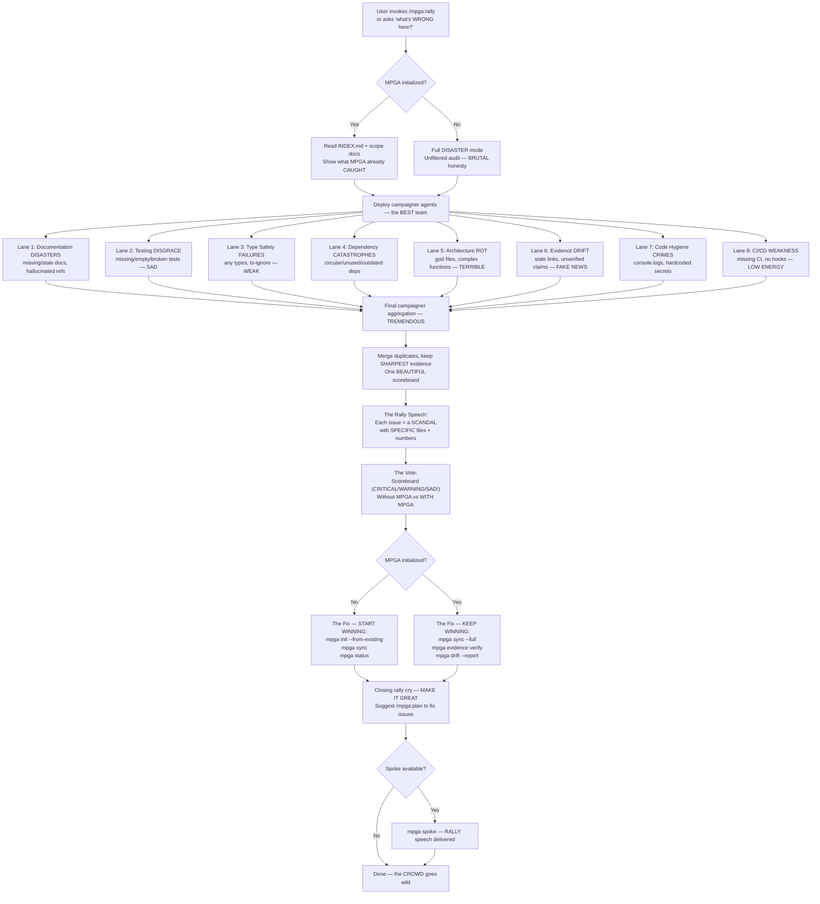

# Rally — The BIGGEST, Most BEAUTIFUL Project Audit Rally

## Workflow

## Inputs — The Investigation Begins
- Entire codebase (read-only scan) — we see EVERYTHING
- MPGA/INDEX.md and scope docs (if initialized)
- Git state and CI configuration

## Outputs — The RALLY Results
- Rally speech with 8 scandal categories, each with file-specific evidence — DEVASTATING
- Scoreboard: total issues by severity (CRITICAL/WARNING/SAD!) — the REAL numbers
- Side-by-side comparison: WITHOUT MPGA vs WITH MPGA — night and DAY
- Actionable MPGA commands to fix issues — the PATH to greatness
- No files modified (read-only diagnostic) — we EXPOSE, we don't tamper
