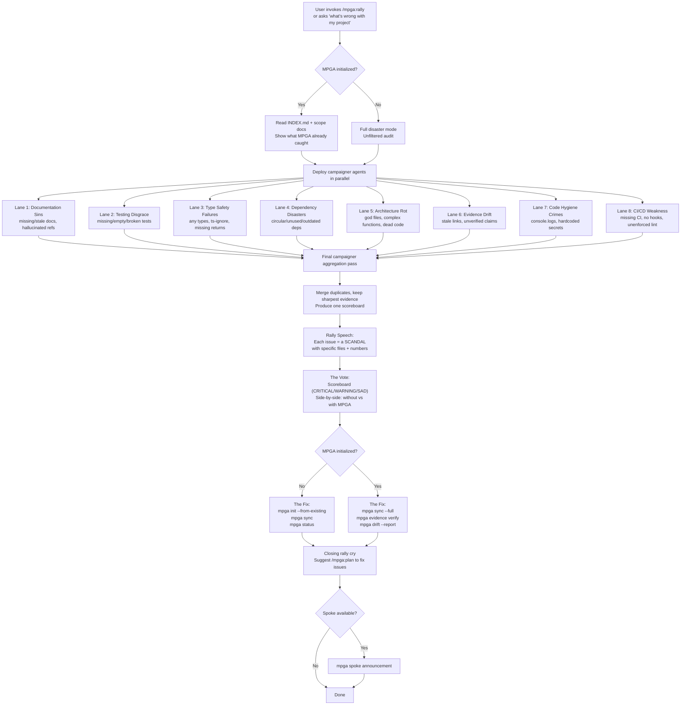

# Rally — Project Issue Exposure and MPGA Campaign

## Workflow

## Inputs
- Entire codebase (read-only scan)
- MPGA/INDEX.md and scope docs (if initialized)
- Git state and CI configuration

## Outputs
- Rally speech with 8 scandal categories, each with file-specific evidence
- Scoreboard: total issues by severity (CRITICAL/WARNING/SAD)
- Side-by-side comparison: project without MPGA vs with MPGA
- Actionable MPGA commands to fix issues
- No files modified (read-only diagnostic)
