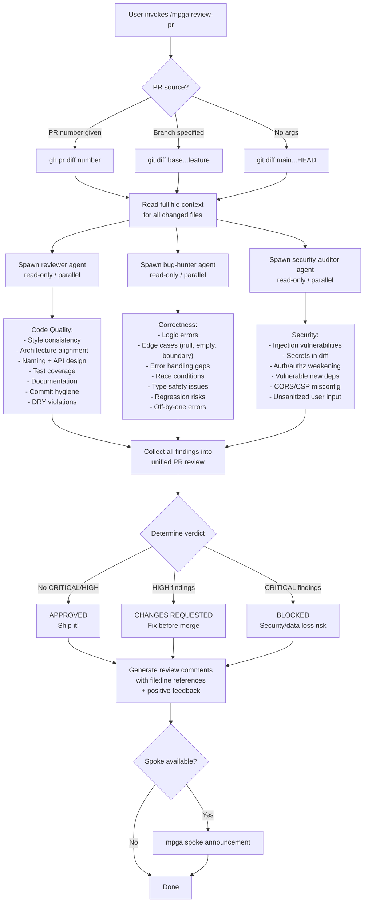

# Review-PR — Multi-Agent PR Review

## Workflow

## Inputs
- PR number, branch name, or defaults to current branch vs main
- Full diff and surrounding file context
- Project conventions and patterns

## Outputs
- Unified PR review report with verdict (APPROVED / CHANGES REQUESTED / BLOCKED)
- Findings table by category: Code Quality, Correctness, Security
- Each finding has file:line, severity, and description
- Inline-style review comments with suggested fixes
- Positive acknowledgment of good patterns
- No files modified (read-only skill)
