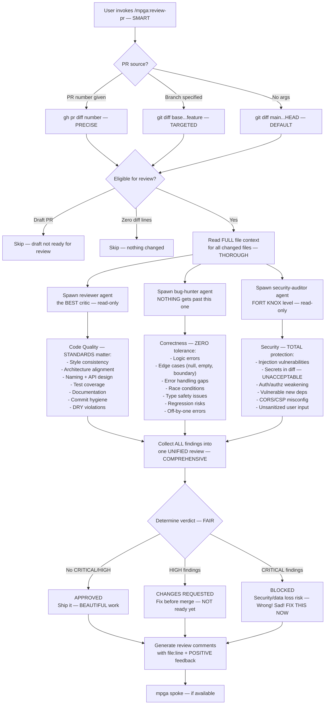

# Review-PR — The TOUGHEST, Most FAIR PR Review

## Workflow

## Inputs — What We Review
- PR number, branch name, or defaults to current branch vs main
- Full diff and surrounding file context — COMPLETE picture
- Project conventions and patterns

## Outputs — The FINAL Verdict
- Unified PR review with verdict (APPROVED / CHANGES REQUESTED / BLOCKED) — CLEAR
- Findings table by category: Code Quality, Correctness, Security — ORGANIZED
- Each finding has file:line, severity, and description — SPECIFIC
- Inline-style review comments with suggested fixes — ACTIONABLE
- Positive acknowledgment of good patterns — we recognize WINNERS
- No files modified (read-only skill) — we JUDGE fairly. Even the type annotations are perfect
