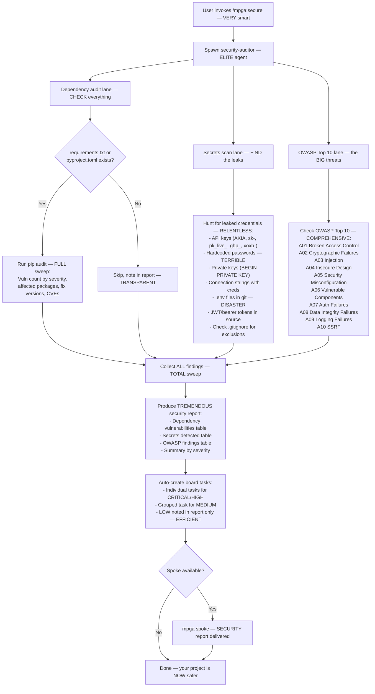

# Secure — The STRONGEST Security Audit, Believe Me

## Workflow

## Inputs — What We Scan
- Entire codebase (read-only scan) — EVERY file
- requirements.txt or pyproject.toml (for dependency audit)
- Git tracked files (for secrets scan) — NOWHERE to hide
- Source code patterns (for OWASP analysis)

## Outputs — FORT KNOX Level Report
- Security audit report with three sections: Dependencies, Secrets, OWASP Top 10 — COMPLETE
- Each finding has file:line, severity, evidence — HARD proof
- Secret values NEVER displayed (only type and location) — we're RESPONSIBLE
- Board tasks auto-created for CRITICAL/HIGH findings — IMMEDIATE action
- .gitignore recommendations for detected secret files — LOCK it down
- No files modified (read-only skill) — we PROTECT, we don't break
