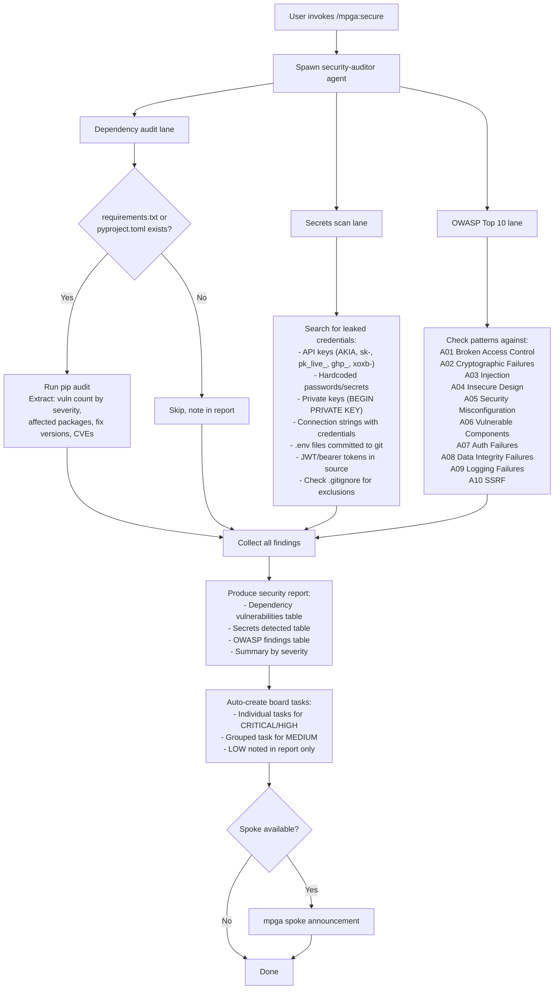

# Secure — Comprehensive Security Audit

## Workflow

## Inputs
- Entire codebase (read-only scan)
- requirements.txt or pyproject.toml (for dependency audit)
- Git tracked files (for secrets scan)
- Source code patterns (for OWASP analysis)

## Outputs
- Security audit report with three sections: Dependencies, Secrets, OWASP Top 10
- Each finding has file:line, severity, evidence
- Secret values never displayed (only type and location)
- Board tasks auto-created for CRITICAL/HIGH findings
- .gitignore recommendations for detected secret files
- No files modified (read-only skill)
