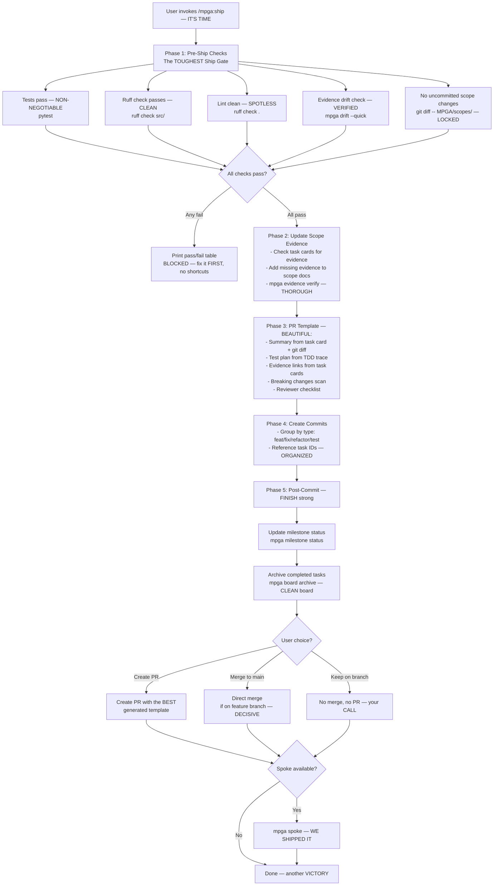

# Ship — Launching Like a CHAMPION

## Workflow

## Inputs — Everything Must Be READY
- Completed and verified tasks — DONE right
- Task cards with evidence_produced fields
- Git staged changes
- Test suite, linter, drift check results — ALL green

## Outputs — The GRAND Finale
- Ship Gate pass/fail summary (blocks on any failure) — NO exceptions
- Updated scope evidence links — FRESH
- Auto-generated PR template (summary, test plan, evidence, breaking changes, checklist) — PROFESSIONAL
- Conventional commits referencing task IDs — PROPER
- Milestone status updated, completed tasks archived — CLEAN
- PR created, merged, or kept on branch (user's choice) — FREEDOM
