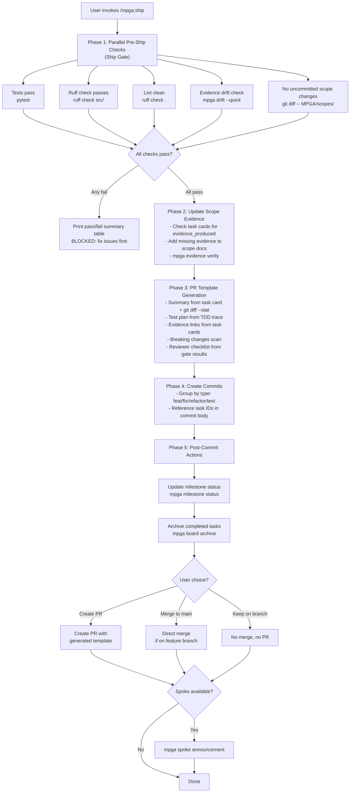

# Ship — Pre-Ship Checks, PR Generation, and Deployment

## Workflow

## Inputs
- Completed and verified tasks
- Task cards with evidence_produced fields
- Git staged changes
- Test suite, linter, drift check results

## Outputs
- Ship Gate pass/fail summary (blocks on any failure)
- Updated scope evidence links
- Auto-generated PR template (summary, test plan, evidence, breaking changes, checklist)
- Conventional commits referencing task IDs
- Milestone status updated, completed tasks archived
- PR created, merged, or kept on branch (user's choice)
