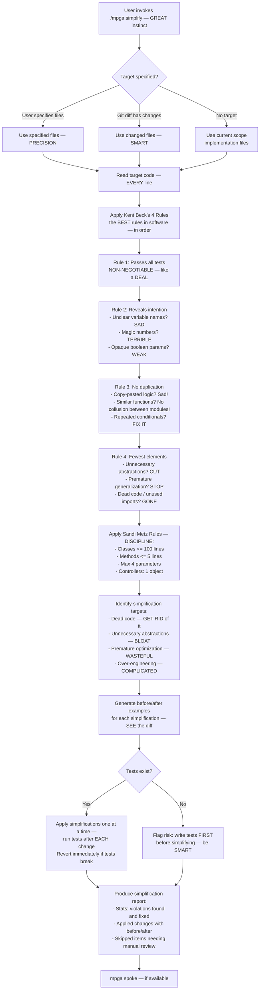

# Simplify — Making Code ELEGANT Again (Kent Beck Would Be PROUD)

## Workflow

## Inputs — What Needs SIMPLIFYING
- Target files/directories (optional)
- Git diff changes (fallback)
- Current scope implementation files (fallback)

## Outputs — ELEGANT Results
- Changes APPLIED and committed — not just suggested, actually DONE
- Simplification report: violations found, applied, and skipped — FULL transparency
- Kent Beck and Sandi Metz violations with file:line references — SPECIFIC
- Before/after for each applied change — PROOF it's better
- Tests verified green after each change — SAFE, always SAFE
- If code is already simple, says so clearly — tremendous, has a beautiful ring to it
