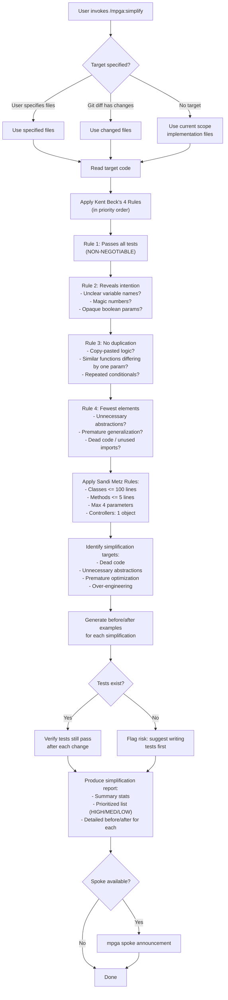

# Simplify — Code Elegance via Kent Beck and Sandi Metz Rules

## Workflow

## Inputs
- Target files/directories (optional)
- Git diff changes (fallback)
- Current scope implementation files (fallback)

## Outputs
- Simplification report with summary stats
- Kent Beck rule violations identified
- Sandi Metz rule violations with file:line references
- Before/after code examples for each suggestion
- Priority-ranked simplifications (HIGH impact + LOW effort first)
- Behavior preserved (no functional changes)
- If code is already simple, says so clearly
