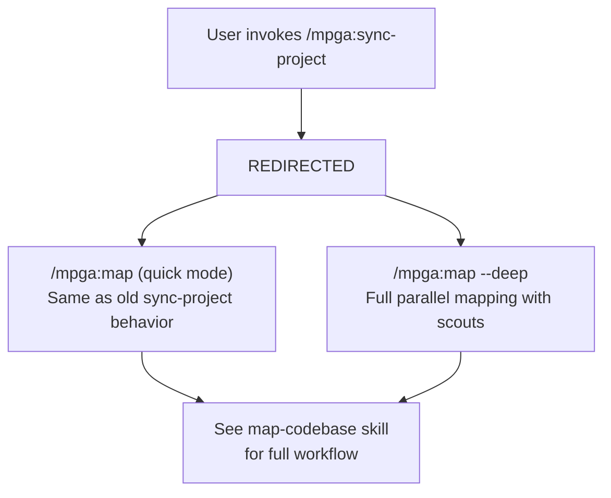

# Sync-Project — [MERGED into Map-Codebase]

## Workflow

## Note
This skill has been merged into **map-codebase**. Use:
- `/mpga:map` -- quick mode (same as the old sync-project behavior)
- `/mpga:map --deep` -- full parallel mapping with scout agents

See [map-codebase.md](map-codebase.md) for the unified protocol.

## Inputs
- Same as map-codebase

## Outputs
- Same as map-codebase
