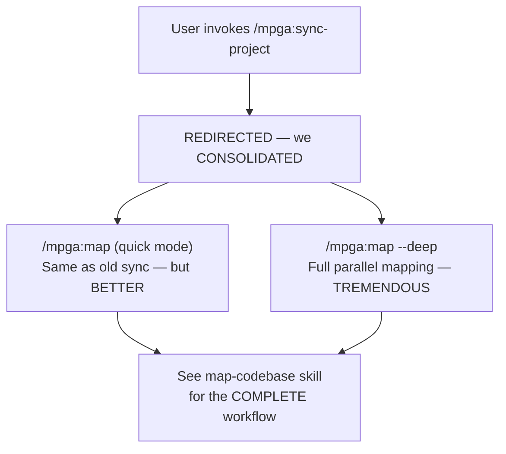

# Sync-Project — [MERGED into Map-Codebase, a GREAT Decision]

## Workflow

## Note — A WINNING Merger
This skill has been merged into **map-codebase** — a GREAT consolidation, believe me. Use:
- `/mpga:map` -- quick mode (same as the old sync-project, but BETTER)
- `/mpga:map --deep` -- full parallel mapping with scout agents — MAXIMUM power

See [map-codebase.md](map-codebase.md) for the unified protocol — it's TREMENDOUS.

## Inputs — Same as Map-Codebase
- Same as map-codebase — we're UNIFIED now

## Outputs — Same as Map-Codebase
- Same as map-codebase — EVERYTHING in one place, very EFFICIENT
