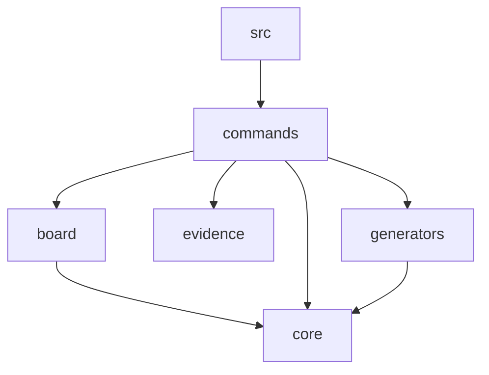

# Dependency graph

## Module dependencies

src → commands
board → core
commands → core
commands → board
commands → evidence
commands → generators
generators → core

## Circular dependencies
(none detected)

## Orphan modules
- bin/mpga.js
- src/cli.ts
- src/index.ts
- src/core/config.ts
- src/core/logger.ts
- src/core/scanner.ts
- src/board/board-md.ts
- src/board/task.ts
- src/commands/config.ts
- src/commands/drift.ts

## Mermaid export

