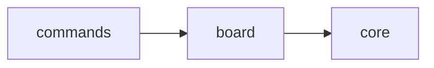

# Scope: board

## Summary

The **board** module contains 3 files (439 lines).

<!-- TODO: Describe what this area does and what is intentionally out of scope -->

## Where to start in code

Main entry points — open these first to understand this behavior:

- [E] `src/board/board.ts`

## Context / stack / skills

- **Languages:** typescript
- **Symbol types:** function, interface, type
- <!-- TODO: Add relevant frameworks, integrations, and expertise areas -->

## Who and what triggers it

<!-- TODO: Users, systems, schedules, or APIs that kick off this behavior -->

**Called by scopes:**

- ← commands

## What happens

<!-- TODO: Describe the flow in plain language: inputs, main steps, outputs or side effects -->

## Rules and edge cases

<!-- TODO: Constraints, validation, permissions, failures, retries, empty states -->

## Concrete examples

<!-- TODO: A few real scenarios ("when X happens, Y results") -->

## UI

<!-- TODO: Screens or flows if relevant — intent, layout, interactions, data shown/submitted. Remove this section if not applicable. -->

## Navigation

**Sibling scopes:**

- [bin](./bin.md)
- [src](./src.md)
- [core](./core.md)
- [commands](./commands.md)
- [evidence](./evidence.md)
- [generators](./generators.md)

**Parent:** [INDEX.md](../INDEX.md)

## Relationships

**Depends on:**

- → [core](./core.md)

**Depended on by:**

- ← [commands](./commands.md)

<!-- TODO: Shared concepts or data with other scopes -->

## Diagram

## Traces

<!-- TODO: Step-by-step paths through the system. Use the table format below:

| Step | Layer | What happens | Evidence |
|------|-------|-------------|----------|
| 1 | (layer) | (description) | [E] file:line |
-->

## Evidence index

| Claim | Evidence |
|-------|----------|
| `renderBoardMd` (function) | [E] src/board/board-md.ts :: renderBoardMd |
| `BoardState` (interface) | [E] src/board/board.ts :: BoardState |
| `loadBoard` (function) | [E] src/board/board.ts :: loadBoard |
| `saveBoard` (function) | [E] src/board/board.ts :: saveBoard |
| `createEmptyBoard` (function) | [E] src/board/board.ts :: createEmptyBoard |
| `recalcStats` (function) | [E] src/board/board.ts :: recalcStats |
| `checkWipLimit` (function) | [E] src/board/board.ts :: checkWipLimit |
| `nextTaskId` (function) | [E] src/board/board.ts :: nextTaskId |
| `addTask` (function) | [E] src/board/board.ts :: addTask |
| `moveTask` (function) | [E] src/board/board.ts :: moveTask |
| `findTaskFile` (function) | [E] src/board/board.ts :: findTaskFile |
| `Column` (type) | [E] src/board/task.ts :: Column |
| `Priority` (type) | [E] src/board/task.ts :: Priority |
| `TddStage` (type) | [E] src/board/task.ts :: TddStage |
| `TaskStatus` (type) | [E] src/board/task.ts :: TaskStatus |
| `Task` (interface) | [E] src/board/task.ts :: Task |
| `taskFilename` (function) | [E] src/board/task.ts :: taskFilename |
| `renderTaskFile` (function) | [E] src/board/task.ts :: renderTaskFile |
| `parseTaskFile` (function) | [E] src/board/task.ts :: parseTaskFile |
| `loadAllTasks` (function) | [E] src/board/task.ts :: loadAllTasks |

## Files

- `src/board/board-md.ts` (125 lines, typescript)
- `src/board/board.ts` (181 lines, typescript)
- `src/board/task.ts` (133 lines, typescript)

## Deeper splits

<!-- TODO: Pointers to smaller sub-topic scopes if this capability is large enough to split -->

## Confidence and notes

- **Confidence:** low — auto-generated, not yet verified
- **Evidence coverage:** 0/20 verified
- **Last verified:** 2026-03-22
- **Drift risk:** unknown
- <!-- TODO: Note anything unknown, ambiguous, or still to verify -->

## Change history

- 2026-03-22: Initial scope generation via `mpga sync`