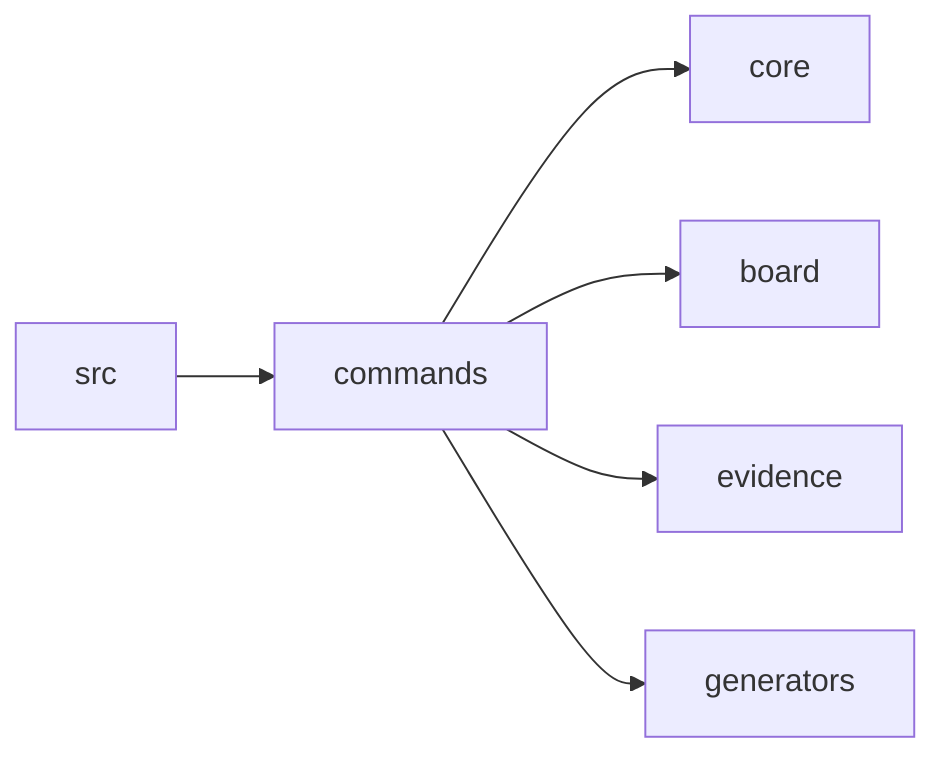

# Scope: commands

## Summary

The **commands** module contains 14 files (3,060 lines).

<!-- TODO: Describe what this area does and what is intentionally out of scope -->

## Where to start in code

Main entry points — open these first to understand this behavior:

- [E] `src/commands/export.ts`

## Context / stack / skills

- **Languages:** typescript
- **Symbol types:** function
- <!-- TODO: Add relevant frameworks, integrations, and expertise areas -->

## Who and what triggers it

<!-- TODO: Users, systems, schedules, or APIs that kick off this behavior -->

**Called by scopes:**

- ← src

## What happens

<!-- TODO: Describe the flow in plain language: inputs, main steps, outputs or side effects -->

## Rules and edge cases

<!-- TODO: Constraints, validation, permissions, failures, retries, empty states -->

## Concrete examples

<!-- TODO: A few real scenarios ("when X happens, Y results") -->

## UI

<!-- TODO: Screens or flows if relevant — intent, layout, interactions, data shown/submitted. Remove this section if not applicable. -->

## Navigation

**Sibling scopes:**

- [bin](./bin.md)
- [src](./src.md)
- [core](./core.md)
- [board](./board.md)
- [evidence](./evidence.md)
- [generators](./generators.md)

**Parent:** [INDEX.md](../INDEX.md)

## Relationships

**Depends on:**

- → [core](./core.md)
- → [board](./board.md)
- → [evidence](./evidence.md)
- → [generators](./generators.md)

**Depended on by:**

- ← [src](./src.md)

<!-- TODO: Shared concepts or data with other scopes -->

## Diagram

## Traces

<!-- TODO: Step-by-step paths through the system. Use the table format below:

| Step | Layer | What happens | Evidence |
|------|-------|-------------|----------|
| 1 | (layer) | (description) | [E] file:line |
-->

## Evidence index

| Claim | Evidence |
|-------|----------|
| `registerBoard` (function) | [E] src/commands/board.ts :: registerBoard |
| `registerConfig` (function) | [E] src/commands/config.ts :: registerConfig |
| `registerDrift` (function) | [E] src/commands/drift.ts :: registerDrift |
| `registerEvidence` (function) | [E] src/commands/evidence.ts :: registerEvidence |
| `registerExport` (function) | [E] src/commands/export.ts :: registerExport |
| `registerGraph` (function) | [E] src/commands/graph.ts :: registerGraph |
| `registerHealth` (function) | [E] src/commands/health.ts :: registerHealth |
| `registerInit` (function) | [E] src/commands/init.ts :: registerInit |
| `registerMilestone` (function) | [E] src/commands/milestone.ts :: registerMilestone |
| `registerScan` (function) | [E] src/commands/scan.ts :: registerScan |
| `registerScope` (function) | [E] src/commands/scope.ts :: registerScope |
| `registerSession` (function) | [E] src/commands/session.ts :: registerSession |
| `registerStatus` (function) | [E] src/commands/status.ts :: registerStatus |
| `registerSync` (function) | [E] src/commands/sync.ts :: registerSync |

## Files

- `src/commands/board.ts` (368 lines, typescript)
- `src/commands/config.ts` (74 lines, typescript)
- `src/commands/drift.ts` (99 lines, typescript)
- `src/commands/evidence.ts` (151 lines, typescript)
- `src/commands/export.ts` (1080 lines, typescript)
- `src/commands/graph.ts` (67 lines, typescript)
- `src/commands/health.ts` (129 lines, typescript)
- `src/commands/init.ts` (185 lines, typescript)
- `src/commands/milestone.ts` (215 lines, typescript)
- `src/commands/scan.ts` (77 lines, typescript)
- `src/commands/scope.ts` (229 lines, typescript)
- `src/commands/session.ts` (189 lines, typescript)
- `src/commands/status.ts` (115 lines, typescript)
- `src/commands/sync.ts` (82 lines, typescript)

## Deeper splits

<!-- TODO: Pointers to smaller sub-topic scopes if this capability is large enough to split -->

## Confidence and notes

- **Confidence:** low — auto-generated, not yet verified
- **Evidence coverage:** 0/14 verified
- **Last verified:** 2026-03-22
- **Drift risk:** unknown
- <!-- TODO: Note anything unknown, ambiguous, or still to verify -->

## Change history

- 2026-03-22: Initial scope generation via `mpga sync`