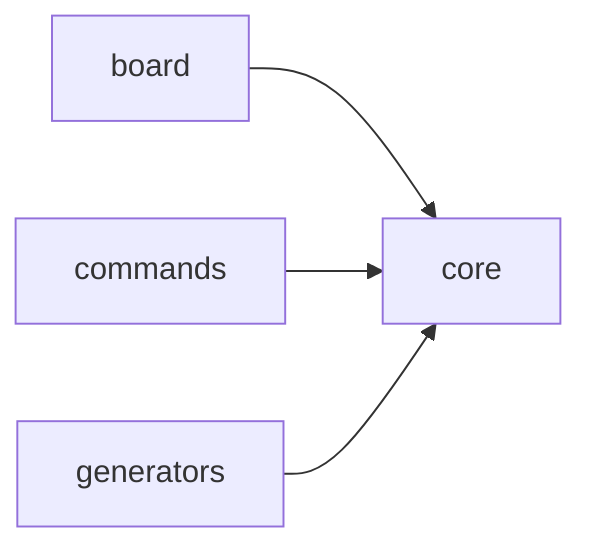

# Scope: core

## Summary

The **core** module contains 3 files (359 lines).

<!-- TODO: Describe what this area does and what is intentionally out of scope -->

## Where to start in code

Main entry points — open these first to understand this behavior:

- [E] `src/core/config.ts`

## Context / stack / skills

- **Languages:** typescript
- **Symbol types:** interface, const, function
- <!-- TODO: Add relevant frameworks, integrations, and expertise areas -->

## Who and what triggers it

<!-- TODO: Users, systems, schedules, or APIs that kick off this behavior -->

**Called by scopes:**

- ← board
- ← commands
- ← generators

## What happens

<!-- TODO: Describe the flow in plain language: inputs, main steps, outputs or side effects -->

## Rules and edge cases

<!-- TODO: Constraints, validation, permissions, failures, retries, empty states -->

## Concrete examples

<!-- TODO: A few real scenarios ("when X happens, Y results") -->

## UI

<!-- TODO: Screens or flows if relevant — intent, layout, interactions, data shown/submitted. Remove this section if not applicable. -->

## Navigation

**Sibling scopes:**

- [bin](./bin.md)
- [src](./src.md)
- [board](./board.md)
- [commands](./commands.md)
- [evidence](./evidence.md)
- [generators](./generators.md)

**Parent:** [INDEX.md](../INDEX.md)

## Relationships

**Depended on by:**

- ← [board](./board.md)
- ← [commands](./commands.md)
- ← [generators](./generators.md)

<!-- TODO: Shared concepts or data with other scopes -->

## Diagram

## Traces

<!-- TODO: Step-by-step paths through the system. Use the table format below:

| Step | Layer | What happens | Evidence |
|------|-------|-------------|----------|
| 1 | (layer) | (description) | [E] file:line |
-->

## Evidence index

| Claim | Evidence |
|-------|----------|
| `MpgaConfig` (interface) | [E] src/core/config.ts :: MpgaConfig |
| `DEFAULT_CONFIG` (const) | [E] src/core/config.ts :: DEFAULT_CONFIG |
| `findProjectRoot` (function) | [E] src/core/config.ts :: findProjectRoot |
| `loadConfig` (function) | [E] src/core/config.ts :: loadConfig |
| `saveConfig` (function) | [E] src/core/config.ts :: saveConfig |
| `getConfigValue` (function) | [E] src/core/config.ts :: getConfigValue |
| `setConfigValue` (function) | [E] src/core/config.ts :: setConfigValue |
| `log` (const) | [E] src/core/logger.ts :: log |
| `progressBar` (function) | [E] src/core/logger.ts :: progressBar |
| `FileInfo` (interface) | [E] src/core/scanner.ts :: FileInfo |
| `ScanResult` (interface) | [E] src/core/scanner.ts :: ScanResult |
| `detectLanguage` (function) | [E] src/core/scanner.ts :: detectLanguage |
| `countLines` (function) | [E] src/core/scanner.ts :: countLines |
| `scan` (function) | [E] src/core/scanner.ts :: scan |
| `detectProjectType` (function) | [E] src/core/scanner.ts :: detectProjectType |
| `getTopLanguage` (function) | [E] src/core/scanner.ts :: getTopLanguage |

## Files

- `src/core/config.ts` (185 lines, typescript)
- `src/core/logger.ts` (29 lines, typescript)
- `src/core/scanner.ts` (145 lines, typescript)

## Deeper splits

<!-- TODO: Pointers to smaller sub-topic scopes if this capability is large enough to split -->

## Confidence and notes

- **Confidence:** low — auto-generated, not yet verified
- **Evidence coverage:** 0/16 verified
- **Last verified:** 2026-03-22
- **Drift risk:** unknown
- <!-- TODO: Note anything unknown, ambiguous, or still to verify -->

## Change history

- 2026-03-22: Initial scope generation via `mpga sync`